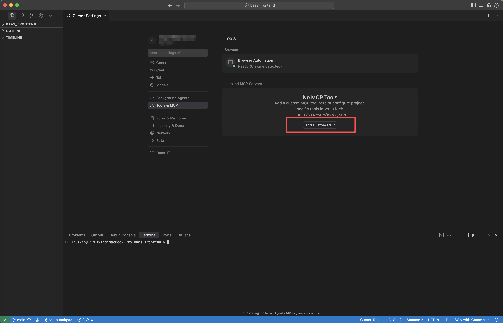
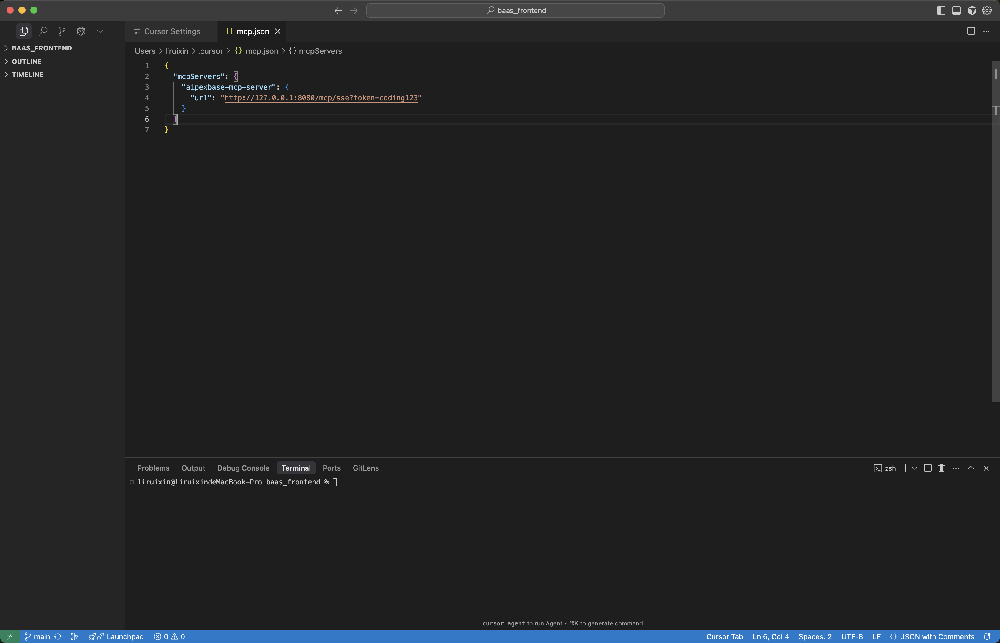
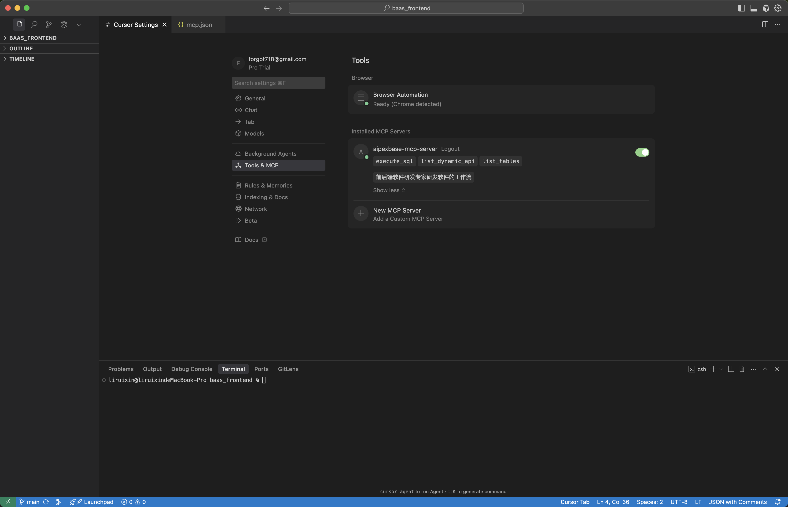
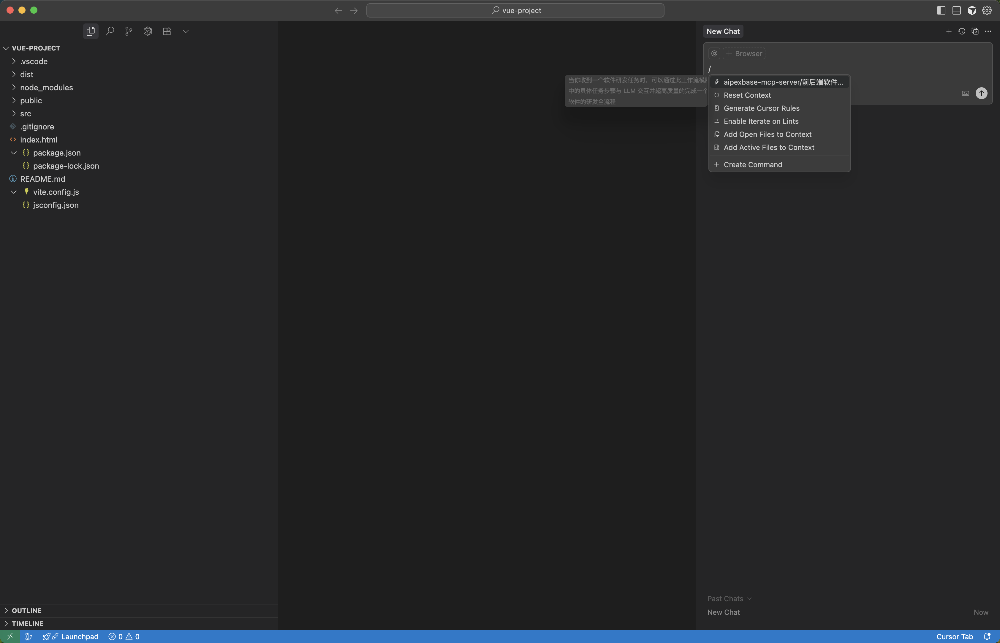
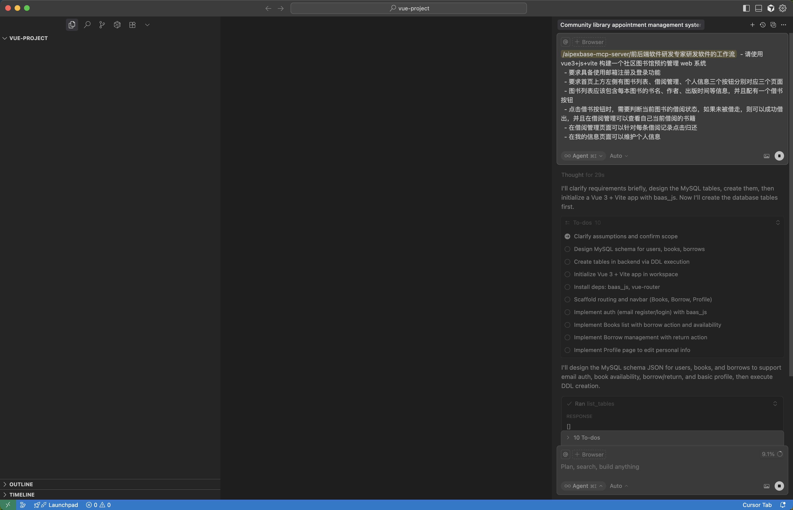
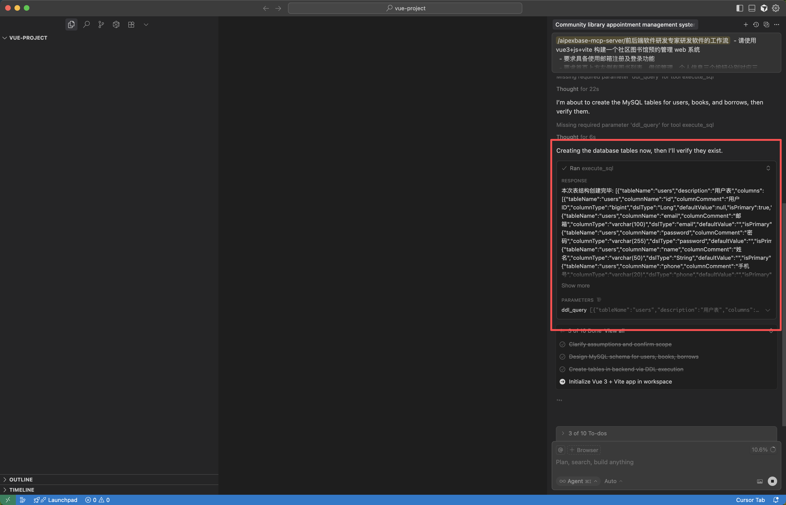
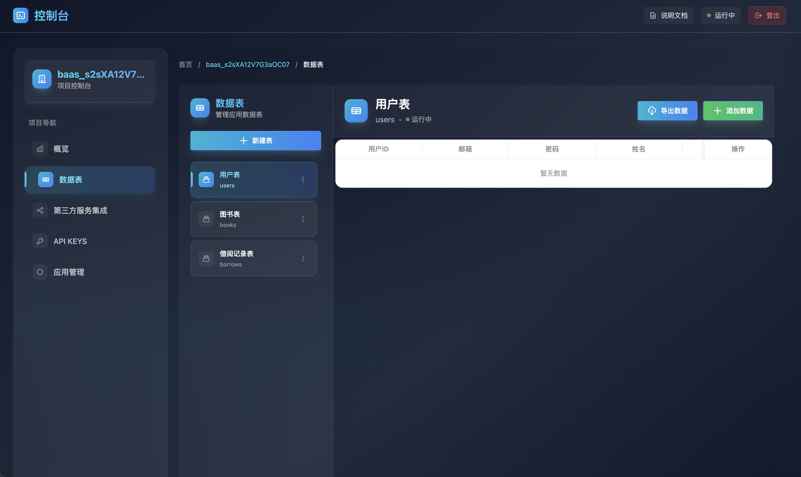
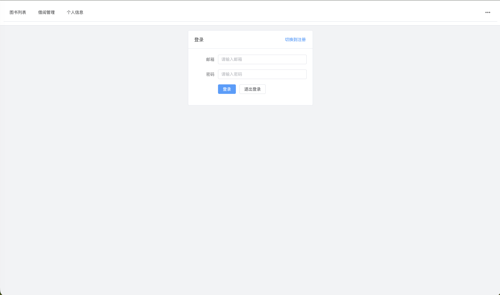

# Native Integration with AIPEXBASE Full-Skill MCP Server in AI IDEs for Rapid Application Development

## Creating an Application
- Step 1: Navigate to the AIPEXBASE admin panel to create an application
- Enter the application you created and click on **API KEYS** in the left sidebar to access the key management page
- Fill in the information to create an API KEY for the current application, then copy and save it

## Open AI IDE
Examples include: Trae or Cursor (using Cursor as an example below)

## Configure MCP Servers in Cursor Settings
```bash
Add this configuration item
Replace the domain and paste the apikey from the above steps after token=

{
  "mcpServers": {
    "aipexbase-mcp-server": {
      "url": "http://your-domain-or-ip/mcp/sse?token=coding123"
    }
  }
}
```



## After configuration, it should look like the following:



## Successfully Loaded MCP TOOL & MCP PROMPT



## Loading Prompts (Cursor supports dynamic prompt loading; for other IDEs like Trae, please refer to the guide at the end)

  ### First, click **Toggle AI Pane** in the top right corner of Cursor to open the AI dialog. Enter `/` in the dialog to activate and select AIPEXBASE built-in software development prompts
  



  ### Start conversing with AI. Clearly describe your requirements and continuously monitor code adjustments. Keep the conversation going with AI to refine the project until the frontend development is complete. The backend is entirely handled by aipexbase.js + AIPEXBASE
  aipexbase.js is a JavaScript SDK used to integrate with the frontend and call the AIPEXBASE backend. AI will automatically invoke aipexbase.js for code generation. For aipexbase.js usage, please refer to: https://vvx03gck2p.feishu.cn/docx/LSsLdYZQfoAo3zxTkwrcJuGVnC3 [Frontend Quick Integration Guide]


Example:
  - Build a community library reservation management web system using Vue3 + JavaScript + Vite
  - Require email-based registration and login functionality
  - The homepage should have three buttons on the top left: Book List, Loan Management, and Personal Information, each corresponding to a separate page
  - The Book List should include information such as book title, author, publication date, etc., for each book, with a borrow button
  - When clicking the borrow button, check the current book's loan status. If it's not already borrowed, the loan can be successful, and borrowed books can be viewed in Loan Management
  - In the Loan Management page, users can click return for each loan record
  - In the Personal Information page, users can maintain their personal information


## Start Development - Cursor will organize development tasks based on context



## Automatically create database tables in the AIPEXBASE application corresponding to the MCP server token


## View table creation status in the admin panel



## Continue conversing with AI and making modifications to further refine the project functionality


## Integrating AIPEXBASE in Trae
Click the link to install the AIPEXBASE agent: https://s.trae.com.cn/a/cfa8bb


## Finally, We Welcome Contributions of More MCP Tools
```bash
../backend/src/main/java/com/kuafuai/manage/mcp/tool/
```
